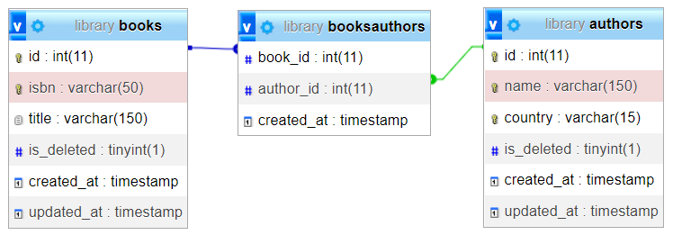

<div align="center">
  <h1>Books and Authors </h1>
  <strong>⚡️ This application allows you to make a CRUD related to books and authors. ⚡️</strong>
</div>

### 📝 Technologies used:

- Express
- Sequelize
- Swagger
- TypeScript
- MySQL

## 🎇 First steps

- Before running the application, you must configure the database.
  In [./assets](./assets/library.sql), you have available a SQL file with the database structure, you can import this file from a SQL client, remember to create the database first and then import the structure using [this](./assets/library.sql) file.
- you must define the values of the configuration variables, you can use the [env-example](./env-example) file as for the configuration of the environment variables.

### 🚀 Quick Start

- Clone this repo:
  ```bash
  git clone https://github.com/christianddev/BooksAndAuthors.git
  ```

#### 💻 Quick start of development:

- Start up the database & check environment variables.
- From the root of the project, run `yarn` or `yarn install`.
- After installing the dependencies,into another terminals:
  - run: `yarn tsc:watch`.
  - run: `yarn dev:env:nodemon`.
- Documentation available into [localhost:8000/api/v1/documentation](http://localhost:8000/api/v1/documentation/).

#### 📝 Short Description.

Some of the business rules have been defined at the database level,
for example:
- In the books table, the isbn field must be unique.
- In the authors table, the fields name & country, in combination must be unique.

The relationship between books and authors is N:M:


#### ⚙ Environment variables

```env
SERVER_PORT
DEVELOPMENT_SERVER
PRODUCTION_SERVER
SERVER_PUBLIC_DIR
SERVER_BASE_URL
SERVER_API_VERSION_URL
SERVER_URL_BOOKS
SERVER_URL_AUTHORS
SERVER_DOCUMENTATION_URL
DATABASE_NAME
DATABASE_USER
DATABASE_PASSWORD
DATABASE_HOST
DATABASE_PORT
DATABASE_DIALECT
DATABASE_LOGGING
DATABASE_TEST_NAME
DATABASE_TEST_USER
DATABASE_TEST_PASSWORD
DATABASE_TEST_HOST
DATABASE_TEST_PORT
DATABASE_TEST_LOGGING
DATABASE_AUTHORS_MODEL_NAME
DATABASE_BOOK_MODEL_NAME
DATABASE_BOOK_AUTHORS_MODEL_NAME
DATABASE_BOOK_AUTHORS_BOOK_ID
DATABASE_BOOK_AUTHORS_AUTHOR_ID
DATABASE_DEFAULT_TEMPORARY_DELETED
DATABASE_DEFAULT_EXCLUDE_ORM_FIELDS
DATABASE_DEFAULT_EXCLUDE_TEMPORARY_DELETED
```

### 🛠️ Understanding folder structure (Main files)

```bash
📦BooksAndAuthors
 ┣ 📂assets
 ┃ ┗ 📜library.sql
 ┣ 📂public
 ┃ ┗ 📜index.html
 ┣ 📂src
 ┃ ┣ 📂controllers
 ┃ ┃ ┣ 📜authorsController.ts # processes api requests related to the path api/v1/authors.
 ┃ ┃ ┣ 📜booksController.ts # processes api requests related to the path api/v1/books.
 ┃ ┃ ┗ 📜index.ts
 ┃ ┣ 📂database
 ┃ ┃ ┗ 📜connection.ts # performs the configuration for the connection to the database.
 ┃ ┣ 📂docs
 ┃ ┃ ┣ 📂common
 ┃ ┃ ┣ 📂examples
 ┃ ┃ ┣ 📂responses
 ┃ ┃ ┣ 📂schemas
 ┃ ┃ ┗ 📜swagger.ts # swagger related configuration.
 ┃ ┣ 📂services
 ┃ ┃ ┣ 📜authorService.ts # performs CRUD operations using AuthorModel.
 ┃ ┃ ┣ 📜bookAuthorService.ts # performs Read & Delete operations using BooksAuthorsModel.
 ┃ ┃ ┣ 📜bookService.ts # performs CRUD operations using BookModel.
 ┃ ┃ ┗ 📜index.ts
 ┃ ┣ 📂middlewares
 ┃ ┃ ┣ 📜AuthorDatabaseValidators.ts # validators associated with the path /api/v1/authors with database check operations.
 ┃ ┃ ┣ 📜BookDatabaseValidators.ts # validators associated with the path /api/v1/books with database check operations.
 ┃ ┃ ┣ 📜fieldsValidators.ts # validations on requests, no database connection is needed.
 ┃ ┃ ┗ 📜index.ts
 ┃ ┣ 📂models
 ┃ ┃ ┣ 📜AuthorModel.ts # authors table configuration using sequelize (Model).
 ┃ ┃ ┣ 📜BookModel.ts # books table configuration using sequelize (Model).
 ┃ ┃ ┣ 📜BooksAuthorsModel.ts # booksAuthors table configuration using sequelize (Model).
 ┃ ┃ ┣ 📜index.ts # exports the models and makes the belongsToMany associations.
 ┃ ┃ ┗ 📜ServerModel.ts # defines the express server configuration.
 ┃ ┣ 📂routes
 ┃ ┃ ┗ 📂v1
 ┃ ┃ ┃ ┣ 📜authorRoutes.ts # paths associated with /api/v1/authors.
 ┃ ┃ ┃ ┣ 📜bookRoutes.ts # paths associated with /api/v1/books.
 ┃ ┃ ┃ ┗ 📜index.ts
 ┃ ┣ 📂typings # types used in the application.
 ┃ ┣ 📂utils
 ┃ ┃ ┣ 📜constants.ts # configuration variables.
 ┃ ┃ ┗ 📜index.ts
 ┃ ┗ 📜app.ts # main file application.
 ┣ 📜package.json

```

### Others

#### Country

- [ISO Code alpha-3](https://en.wikipedia.org/wiki/ISO_3166-1_alpha-3)

##### API response

- [Google JSON Style Guide](https://google.github.io/styleguide/jsoncstyleguide.xml)

### 🛠 Next improvements

- Perform tests to ensure the quality and robustness of the application.
- Improve the typing of data coming from the ORM.
- Apply security over routes using an authentication provider such as OAuth with JWT.
- Add the possibility to export the list using csv or plain text.
- Add pagination for some `GET`, use headers from request:
  - `api/v1/authors`
  - `api/v1/authors/all/books`
  - `api/v1/book`
  - `api/v1/books/all/authors`
- Apply logger
- For the test and development environment, use seders or migrations from sequelize to set up a database.
  to improve the experience.
- Deploy in the cloud and apply | configure CI/CD.

## 👾 known bugs

- api:
  - The database must be ready for operation before starting the application.
- sql:
  - If an author or a book is temporarily deleted, it is not possible to register a new one, as the verification query detects that such a record exists in the database, if the deletion were independent, a new business rule would be that it does not detect that record as a duplicate or existing record, if the database record is temporarily deleted.
